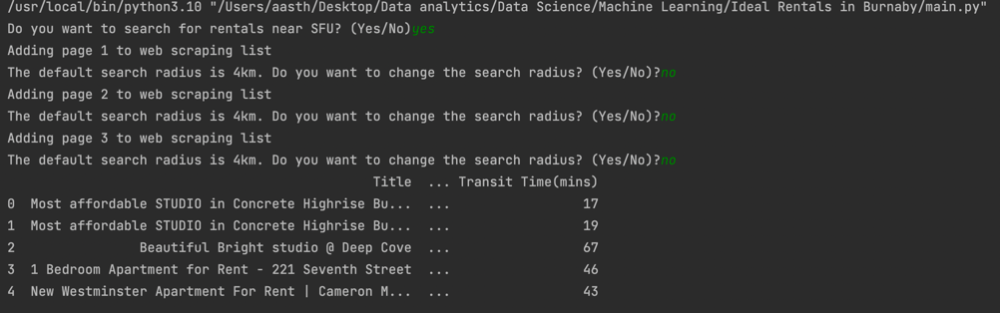

## Objective:

To find a suitable rental near Simon Fraser University.

In order to do this, I extracted all rental listings 4 KM within SFU from Kijiji.ca.

For each listing, I extracted information like no. of bedrooms, no. of bathrooms, is it furnished, does it have AC, does it include hydro,water,heat, price, etc. from Kijiji.

Then for each rental listing, I calculated the transit time from the listing to SFU using HERE Public Transit and Geocode API. 

## Next Steps:

Currently, the final result is saved as excel files. But as a next step, I will try to save the results to a SQL db and create a dashboard so that the results can be interpreted better.